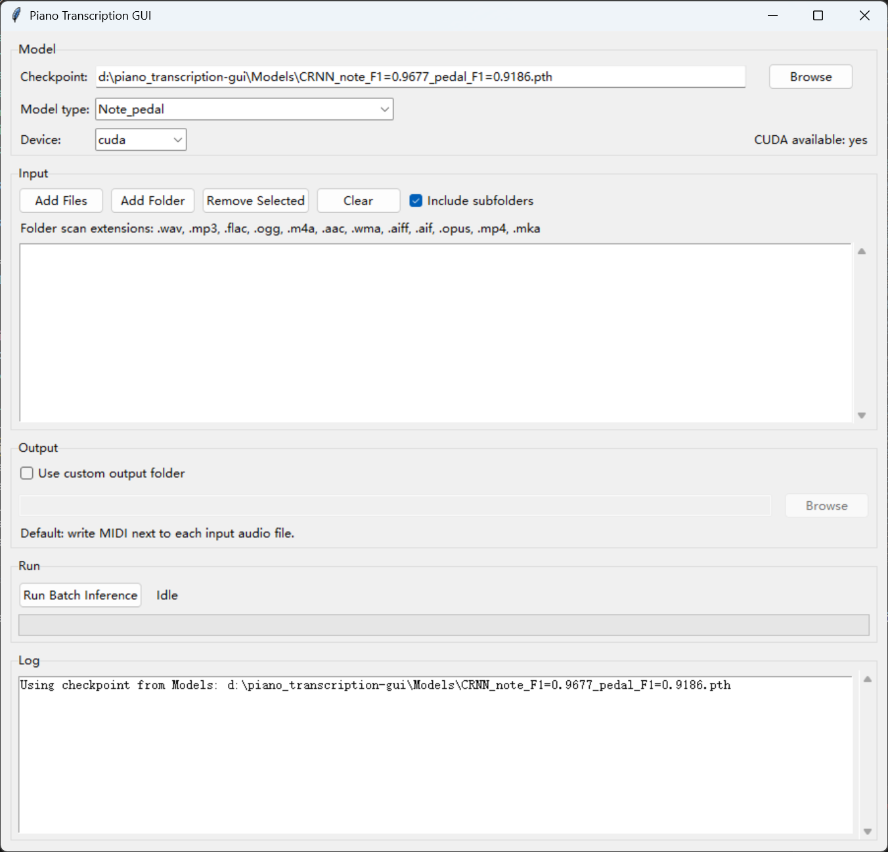

# Piano Transcription GUI (RTX 50 Ready)

Source-only / not packaged yet

This repository is an updated, Windows-friendly fork of ByteDance's
[piano_transcription](https://github.com/bytedance/piano_transcription). It adds:

- A batch GUI for inference (`transcribe_gui.py`)
- Modern PyTorch + CUDA compatibility (including RTX 50 series)
- Quality-of-life fixes for newer `librosa`

The underlying model and method are from:
Qiuqiang Kong et al., "High-resolution Piano Transcription with Pedals by
Regressing Precise Onsets and Offsets Times" (arXiv:2010.01815).

## Quick Start (RTX 50 series)

1) Install NVIDIA drivers (latest stable).
2) Install Python 3.10+ (recommended).
3) Install PyTorch with CUDA 12.x from the official site:
   https://pytorch.org/get-started/locally/
4) Install dependencies:
```
pip install -r requirements-gui.txt
```
5) Install FFmpeg (required for MP3 and many formats):
```
winget install Gyan.FFmpeg
```
6) Place a checkpoint in `Models/` or `models/` (auto-detected) or select it in the GUI.
7) Launch the GUI:
```
python transcribe_gui.py
```

If CUDA is available, choose `cuda` in the GUI.

## GUI Usage

1) Put your checkpoint in `Models/` or `models/` or browse to it.
2) Add files or folders.
3) Run batch inference.



Notes:
- Output defaults to the same folder as each input audio file (custom output is supported).
- If a MIDI file already exists, it auto-renames to `_1`, `_2`, etc.
- Progress bar shows per-audio segment progress (no audio splitting).

## Checkpoint Files

Place your `.pth` model file in `Models/` or `models/` or select it manually in the GUI.
Due to GitHub file size limits, checkpoints are not stored in Git by default.

Download the official pretrained checkpoint from Zenodo:
https://zenodo.org/records/4034264

Steps:
1) Download `CRNN_note_F1=0.9677_pedal_F1=0.9186.pth`.
2) Create `Models/` or `models/` in the repo root if it does not exist.
3) Move the `.pth` file into that folder.

PowerShell example:
```
New-Item -ItemType Directory -Force Models | Out-Null
curl -L -o Models/CRNN_note_F1=0.9677_pedal_F1=0.9186.pth https://zenodo.org/records/4034264/files/CRNN_note_F1=0.9677_pedal_F1=0.9186.pth
```

## Requirements files

- `requirements.txt`: original training environment (legacy pins, Python 3.7 era).
- `requirements-gui.txt`: GUI + inference on modern Python (recommended for RTX 50).
  Install PyTorch separately from https://pytorch.org/get-started/locally/

## Verify CUDA

Use this snippet to confirm GPU visibility:
```python
import torch
print(torch.cuda.is_available())
if torch.cuda.is_available():
    print(torch.cuda.get_device_name(0))
```

## CLI Inference (Optional)

You can also run inference from the CLI:
```
python pytorch/inference.py --model_type Note_pedal ^
  --checkpoint_path Models/your_checkpoint.pth ^
  --audio_path path/to/audio.wav ^
  --cuda
```

## Training (Original Workflow)

Training instructions and dataset preparation are unchanged from the upstream
repo. See `runme.sh` and the original README workflow for details.

## License

Apache 2.0 (code). Pretrained weights from Zenodo are provided by the
original authors and are licensed under CC BY 4.0. See:
https://zenodo.org/records/4034264

## Credits

Original implementation and paper:
https://github.com/bytedance/piano_transcription
